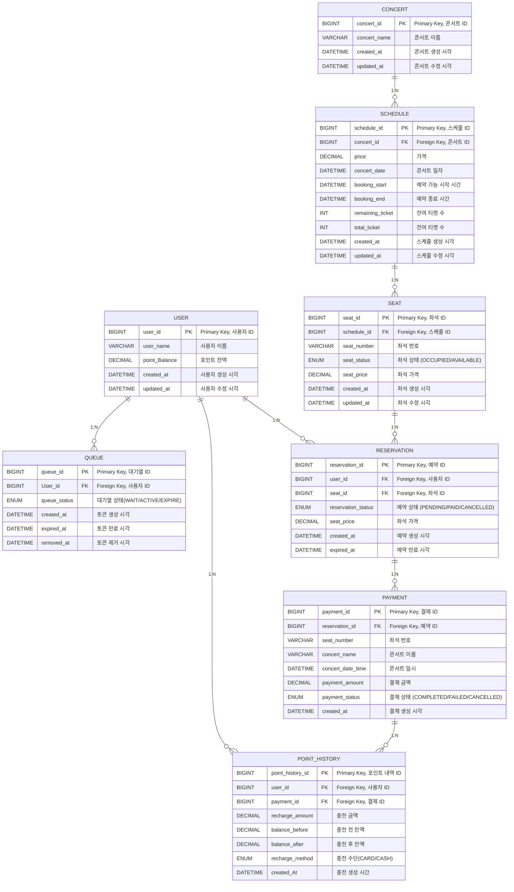

# 콘서트 예약 서비스 서버 구축


## 개요
콘서트 예약 서비스는 대기열 시스템을 사용하여 콘서트 좌석을 예약하고, 예약한 내역에 대해 결제를 진행하는 서비스입니다.
동시성 제어를 통해 동시 예약이나 결제 시 중복으로 처리되지 않도록 설계하였습니다.

## 프로젝트 목표
- 대기열 시스템을 구축하고, 예약 서비스는 작업가능한 유저만 수행할 수 있어야 함.
- 사용자는 좌석예약 시에 미리 충전한 잔액을 이용.
- 좌석 예약 요청시에, 결제가 이루어지지 않더라도 일정 시간동안 다른 유저가 해당 좌석에 접근할 수 없도록 힘.

## 기술 스택
### Backend
- Java 17, Spring Boot 3.1
- Spring Data JPA, Hibernate
- MySQL: 데이터베이스
- Swagger: API 문서화
- Redis: 대기열 관리 및 캐싱
- Kafka: 메세징 처리
- Docker, Docker-compose: 도커 컨테이너 및 자동화

### DevOps
- Grafana: 모니터링 및 로깅
- K6: 부하 테스트

### 기타
- Postman: API 테스트
- Mermaid: ERD 및 시퀀스 다이어그램

## 프로젝트 마일스톤


## 주요 기능
### 1. 대기열 시스템
- 대기열 토큰 발급 API (POST /api/v1/queues)
- 토큰 상태 관리 (WAIT, ACTIVE, EXPIRE)
- 만료 토큰 자동 삭제 (Scheduler 활용)

### 2. 콘서트 예약 기능
- 예약 가능한 날짜 조회 API (GET /api/v1/concerts/{concertId}/schedules)
- 예약 가능한 좌석 조회 API (GET /api/v1/concerts/{concertId}/schedules/{scheduleId}/seats)
- 좌석 예약 API (POST /api/v1/reservations)
- 좌석 상태 (OCCUPIED, AVAILABLE) 관리

### 3. 결제 및 잔액 관리
- 잔액 조회 API (GET /api/v1/users/{userId}/balance)
- 잔액 충전 API (POST /api/v1/users/charge)
- 결제 처리 API (POST /api/v1/payments)
- 결제 성공 시 포인트 차감 및 예약 상태(PAID) 업데이트

## 데이터 모델 (ERD)


## API 문서 (Swagger)
### Swagger: [API 명세서](https://github.com/RabbitHZ/concert-reserve-service/blob/master/docs/API/API_%EB%AA%85%EC%84%B8.md)


## 리팩토링 및 성능 개선

- 동시성 제어 방식 분석: [분석 보고서](https://github.com/RabbitHZ/concert-reserve-service/blob/master/docs/concurrency-controll/%EB%8F%99%EC%8B%9C%EC%84%B1%EC%A0%9C%EC%96%B4_%EB%B6%84%EC%84%9D_%EB%B3%B4%EA%B3%A0%EC%84%9C.md)
- Redis를 활용한 캐싱 최적화: [성능 최적화 보고서](https://github.com/RabbitHZ/concert-reserve-service/blob/master/docs/redis-optimization/%EB%A0%88%EB%94%94%EC%8A%A4_%EC%84%B1%EB%8A%A5_%EC%B5%9C%EC%A0%81%ED%99%94.md)
- DB Index 성능 개선: [DB 성능 개선 보고서](https://github.com/RabbitHZ/concert-reserve-service/blob/STEP19/docs/index/DB_INDEX_%EC%BF%BC%EB%A6%AC_%EC%84%B1%EB%8A%A5_%EA%B0%9C%EC%84%A0_%EB%B3%B4%EA%B3%A0%EC%84%9C.md#db-index-%EC%BF%BC%EB%A6%AC-%EC%84%B1%EB%8A%A5-%EA%B0%9C%EC%84%A0-%EB%B3%B4%EA%B3%A0%EC%84%9C)
- MSA 전환 및 트랜잭션 분리 설계: [MSA 보고서](https://github.com/RabbitHZ/concert-reserve-service/blob/master/docs/msa/MSA_%EC%A0%84%ED%99%98_%EB%B0%8F_%ED%8A%B8%EB%9E%9C%EC%9E%AD%EC%85%98_%EB%B6%84%EB%A6%AC_%EB%B3%B4%EA%B3%A0%EC%84%9C.md)
- 부하 테스트 및 장애 대응 전략: [K6 부하 테스트](https://github.com/RabbitHZ/concert-reserve-service/blob/master/docs/k6/stress.md)

## 프로젝트 실행 방법 
1. 프로젝트 클론
```
git clone https://github.com/hwajinkim/consert-reserv-service.git
cd consert-reserv-service
```
2. Docker Compose 실행
```
docker-compose up -d
```
3. API 테스트
- Postman: Postman Collection


